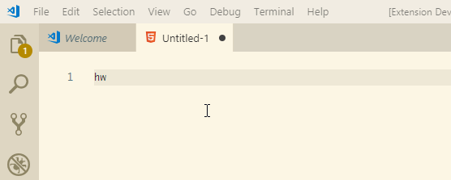

# VSC 插件开发从入门到Hello World

## 1、原理放一边，我们先来个Hello,World

### 1.1 安装基础环境

需要的基础环境列表：

- Node.js
- npm
- vs code
- yo generator-code
  - yo:全称`Yeoman`,可以把他理解为一个代码生成器
  - yo generator-code:是vsc团队基于yo编写的vsc插件的代码生成器

安装npm后通过下面的命令，安装`yo generator -core`

```bash
npm install -g yo generator-code
```

### 1.2 生成你的第一个VSC插件项目

执行下面的命令：

```bash
yo code
```

执行命令后，是下面一番景象：


这里我们先选择New Code Snippets（代码片段）

接着是各种让你选择的东西，我们可以按下面的方式选（粗体为你需要敲的字符）：
- ? Folder name for import or none for new:**直接回车**
- ? What's the name of your extension?  **hello-world**
- ? What's the identifier of your extension? **hello-world**
- ? What's the description of your extension? **it's a demo**
- ? Language id: **html**

完事儿之后，就会帮你创建出来一个`hello-world`的文件夹，里面创建好各种需要的文件，我们用VSC打开这个文件夹，大概是这样一个画风：


我们打开`snippets\snippets.json`文件，并将其内容改为如下：

```json
{
    "hello world": {
        "prefix": "hw",
        "body": [
          "<h1>hello world</h1>"
        ],
        "description": "hello world"
      }
}
```

### 1.3 调试扩展

在VSCode中，直接按下`F5`，稍等片刻即会自动启动一个新的VSCode窗口，在这个新的窗口中，就是已经加载了我们刚才编写的`hello-world`这个扩展。

我们可以通过`ctrl + n`创建一个新的页面，并将点击右下角的`plan text`，在弹出窗口中选择`html`，将文件类型改为html，然后在新的页面中键入`hw`,就可以看到我们刚写的`hello-world`的代码片段已经生效啦。

下面是一张成功后的动图：



## 2. VSC 扩展初探

### 2.1 使用VSC扩展，我们能做哪些事儿？

以下内容来自：<https://code.visualstudio.com/api/extension-capabilities/overview>

- 基础版
  - 注册命令、配置、快捷键、右键菜单等
  - 存储工作空间或者全局数据
  - 显示消息通知
  - 使用快速选择，收集用户输入
  - 打开系统文件选择器，便于用户选择文件或文件夹
  - 使用Progress API显示长时间运行的操作

- 定制主题
  - 更改代码的颜色
  - 更改VSC UI的颜色
  - 自定义文件图标

- 声明语言特性
  - 创造一门新的语言，告诉VSC新语言的语法等语言信息
  - 添加常用代码片段
  - 添加、替换编程语言的语法
  - 使用语法注入扩展现有语法

- 程序化的语言功能
  - 添加显示API的示例用法的悬停
  - 检测代码的语法错误、拼写错误、不规范的代码
  - 格式化代码
  - 为语言添加智能提示

- 扩展Workbench
  - 添加自定义上下文菜单操作到文件资源管理器
  - 在侧栏中创建一个新的交互式TreeView。
  - 定义新的活动栏视图。
  - 在状态栏中显示新信息。
  - 使用`WebView`API 呈现自定义内容。
  - 贡献源控制提供商。

- 调试
  - 通过提供[调试适配器实现，](https://microsoft.github.io/debug-adapter-protocol/implementors/adapters/)将VS Code的调试UI连接到调试器或运行时。
  - 指定调试器扩展支持的语言。
  - 为调试器使用的调试配置属性提供丰富的IntelliSense和悬停信息。
  - 提供调试配置片段。
  - 根据动态创建的调试配置启动调试会话。
  - 跟踪调试会话的生命周期。
  - 以编程方式创建和管理断点。

是不是有点眼花缭乱？没错，VSC几乎可以扩展所有的东西！

那有没有什么不能扩展？

有！那就是出于安全考虑，**禁止扩展访问VSC的DOM元素！**

啥？DOM元素？没错，VSC就是基于HTML + JavaScript编写的

### 2.2 回头仔细看看hello-world扩展

#### 2.2.1 package.json

`package.json`文件中，其实放的很多东西是我们刚才在使用命令行初始化时敲的内容，如下：

```json
{
    "name": "hello-world", // 扩展名称（ID）
    "displayName": "hello-world", // 扩展展示名称
    "description": "it's a demo", // 扩展描述
    "version": "0.0.1", // 版本号
    "engines": {
        "vscode": "^1.32.0" // 兼容的VSC的版本，^1.32.0表示从兼容1.32.0以上的版本
    },
    "categories": [ // 插件的类型
        "Snippets" //表示该插件中会包含代码片段，
    ],
    "contributes": { // 一些额外的信息
        "snippets": [ // 用于代码片段的额外信息
            {
                "language": "html", //该代码片段的语言是html
                "path": "./snippets/snippets.json" // 代码片段位于该文件中
            }
        ]
    }
}
```

那我的项目中，可能不仅仅有`html`，还会有`typescript`、`javascript`怎么办？

其实很简单，只需要在`contributes`下的`snippets`节点中增加即可，类似如下：

```json
{
    "name": "hello-world",
    "displayName": "hello-world",
    "description": "it's a demo",
    "version": "0.0.1",
    "engines": {
        "vscode": "^1.32.0"
    },
    "categories": [
        "Snippets"
    ],
    "contributes": {
        "snippets": [
            {
                "language": "html",
                "path": "./snippets/snippets-html.json"
            },
            {
                "language": "typescript",
                "path": "./snippets/snippets-ts.json"
            },
            {
                "language": "javascript",
                "path": "./snippets/snippets-js.json"
            }
        ]
    }
}
```

当然了，path对应的json文件，也需要手动创建一下。

#### 2.2.2 snippets 文件夹


#### 2.2.3 README.md 文件


#### 2.2.4 CHANGELOG.md


#### 2.2.5 .vscode 文件夹


#### 2.2.6 其他文件


## 3. 如何发布扩展

出于公司代码安全和IT策略限制，我们公司内部的扩展绝对不允许直接发布到[VS Code Extension MarketPlace](https://marketplace.visualstudio.com/vscode)，所以本节只讨论如何在公司范围内发布VS Code扩展

### 3.1.安装VSCE

```bash
npm install -g vsce
```

### 3.2 添加publisher

VS Code在发布时，需要在`package.json`中定义`publisher`,我们调整下上面`hello-world`扩展中的`package.json`为如下：

```json
{
    "name": "hello-world",
    "displayName": "hello-world",
    "description": "it's a demo",
    "version": "0.0.1",
    "engines": {
        "vscode": "^1.32.0"
    },
    "publisher": "jax", 
    "categories": [
        "Snippets"
    ],
    "contributes": {
        "snippets": [
            {
                "language": "html",
                "path": "./snippets/snippets.json"
            }
        ]
    }
}
```

### 3.3 填写Readme.md

在上面第二节中已经提到过readme.md的作用了，vsc团队要求在发布时，一定不能用默认生成的readme.md的内容，那我们就随便改改吧（建议实际操作时，按VSC建议的格式认真写）

### 3.4 打包成.vsix

在插件根目录执行下面的命令：

```bash
vsce package
```

此时它会报个警告信息，让你确认：

```
A 'repository' field is missing from the 'package.json' manifest file.
```

这个是由于我们没有在package.json中填写`repository`字段，可以直接忽略该警告，也可以将你放扩展的源码Git路径填写一下，例如下面这样：

```json
{
    "name": "hello-world",
    "displayName": "hello-world",
    "description": "it's a demo",
    "version": "0.0.2",
    "engines": {
        "vscode": "^1.32.0"
    },
    "publisher": "jax",
    "repository": {
        "url": "https://github.com/"
    },
    "categories": [
        "Snippets"
    ],
    "contributes": {
        "snippets": [
            {
                "language": "html",
                "path": "./snippets/snippets.json"
            }
        ]
    }
}
```

重新执行上面的打包命令，他就会自动生成出一个`hello-world-0.0.2.vsix`文件。


### 3.5 安装扩展

有了这个扩展，你就可以给你的小伙伴拿去安装啦，那怎么安装呢？

首先，在VS Code中按`F1`,并选择`Extensions:Install from VSIX...`这个选项，然后在弹出框中选择刚才通过vsce打包出来的`hello-world-0.0.2.vsix`文件即可安装完成。


安装完成后，我们可以在扩展中找到我们的扩展：

~